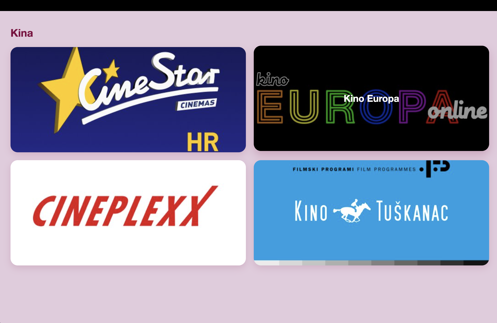
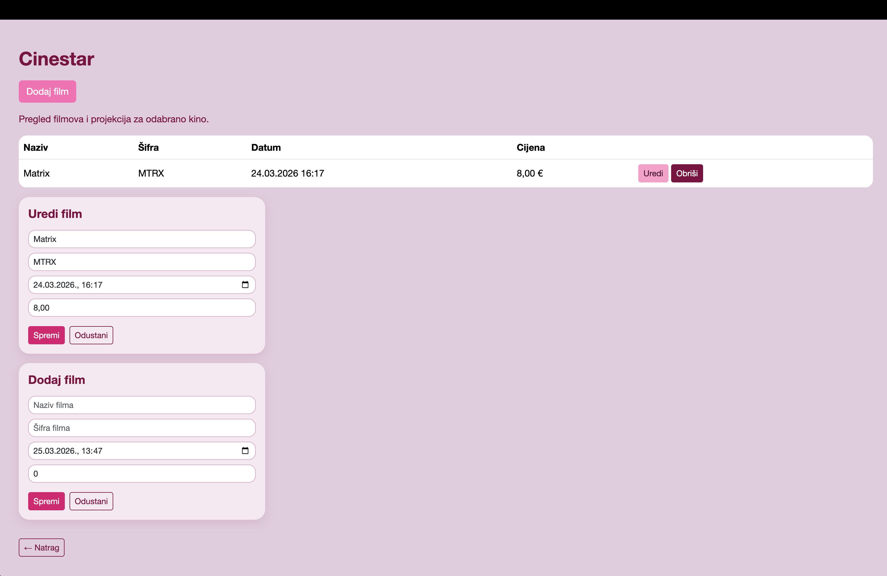

# Blazer Movie App

## Opis projekta
Aplikacija omogućava pregled kina i filmova koji se u njima prikazuju.  
Razvijena je kao web aplikacija koristeći Blazor WebAssembly za frontend i ASP.NET Core Web API za backend, uz Azure SQL bazu podataka.

---

## Funkcionalnosti

- Prikaz svih kina i filmova koji se u njima prikazuju  
- Jedan film može biti prikazan u više kina  
- Unos novog filma u kino  
- Izmjena postojećeg filma  
- Brisanje filma  

Prikaz je organiziran po kinima.

---

## Struktura baze

- Kino (Id, Naziv)  
- Film (Id, Naziv, SifraFilma)  
- KinoFilm (Id, KinoId, FilmId, DatumProjekcije, CijenaKarte)

---

## Tehnologije

- ASP.NET Core Web API  
- Blazor WebAssembly  
- Entity Framework Core  
- Azure SQL Database  
- Azure App Service  
- Azure Static Web Apps  

---

## Live aplikacija

Frontend:  
https://mango-wave-0af19c103.4.azurestaticapps.net/kina  

Backend API:  
https://filmovi-api-egb0b8e9gqb7dua7.westeurope-01.azurewebsites.net/api/kina  

---

Aplikacija omogućava rad s podacima kroz web sučelje te je dostupna putem interneta.
